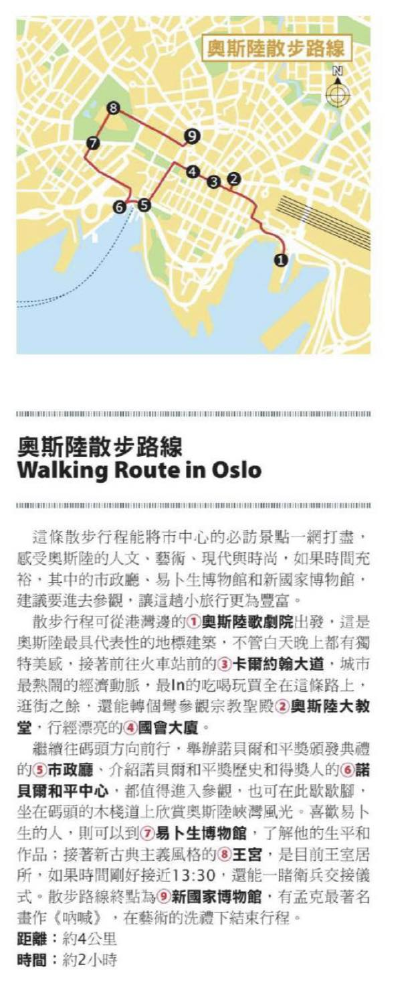

# 0627 (五)

- 天氣 : ?

今天的一開始就是在轉機。

這次機型沒有換了，友人 N 就坐我隔壁。基本上我們整趟不是吃飯，就是一直在睡覺。

值得一提的是因為友人 N 在上機前被我說服一起買了 Croissant 吃，所以當等到泰航最後一頓飯送上來的時候 --

我又又又又又看到了 Croissant。

我看著友人 N。

友人 N : 我覺得我有點飽了。

於是我的面前有了 Croissant 跟 Croissant (1)。

我謝謝你喔，友人 N。

--

在 Oslo 機場下機後第一件事是先買了酒(蘋果氣泡酒 4.7% 應該喝不死我)，然後去機場接駁(又又又把自己的手機鎖起來了)

一路上可以看到很漂亮的鄉村風景、田野等等的。

因為我心中原本預期的挪威其實沒有很發達 (不如說我只是覺得是可能保留了更多漁村風情的國家)

因此，說實話，當從火車站下來的時候這個城市有驚豔到我。

好乾淨的天、鋪滿石磚的路、藍色的電車在路上跑、還有共享滑板停在一邊。

火車站的對面就是港口，整個市中心就依著港灣建造，是在台灣沒看過的風景。

因為我們早上抵達 Oslo (機場接駁過來大概半小時左右)，得以看到這座城市還沒醒來的樣子。

我們推著行李前往第一個住宿點 : [CityBox](https://g.co/kgs/GXDwjaf)

這家旅館是採全自助入住，還挺方便的，重點是離火車站近，大概走路 10 分鐘就到了。

放妥行李後，我們先去了維格蘭雕塑公園。

維格蘭雕塑公園是位於挪威的奧斯陸，一個以雕像為主題的公園。公園內的 212 座雕像是挪威雕像家古斯塔夫·維格朗的作品。

最主要去看以下幾個點 :

- 生命支柱
- 維格蘭噴泉 - 生命之泉
- 維格蘭之橋 - 生命之橋

我們逛的點，順序跟別人是相反的，~~因為在一開始信任 google map 結果從人家後面進去~~

公園很大，但放雕塑的地方其實不多。每一件雕塑都十足壯觀，我自己個人特別喜歡的是生命支柱，遠遠看去矗立在山丘之上尤為驚人，走近看之後，雕像上雕刻的人臉、姿態各異，扭曲的軀體以及圍繞在石柱旁的雕像都顯得莊嚴神聖。

往前走，會看到 維格蘭噴泉 - 生命之泉，對比生命支柱的莊嚴，生命支泉的壯觀體現在大型雕塑頂著石盆，石盆的泉水再從中噴湧而出的景象，圍繞著噴泉的矮牆上每一面都有平面雕塑，生命之泉融合了一些動物的意象，而不是純粹人類肉體的展示。

最後到達生命之橋，有趣生動的雕像姿態變得更多了，拍了幾張讓人印象深刻的雕塑，有些就像幼時父母和我們玩樂時的樣子。

欣賞完畢之後，我們前往了 [奧斯陸城市博物館](https://g.co/kgs/zUnYxs5)

途中經過他們的公園遊樂設施 (友人 N : 好威)。

奧斯陸城市博物館不大，但是對於奧斯陸城市的歷史講的十分詳細，包括一二戰期間的歷史、奧斯陸城市命名的變遷、女權的興起等，麻雀雖小五臟俱全。也對於我們後續遊玩挪威，了解挪威資訊有很大的幫助。

另一個我們在維格蘭公園逛的博物館是 [維格蘭博物館](https://g.co/kgs/Xvts3gu)

裡面更加詳細的介紹了園區內各個雕塑的由來以及創作過程，包括生氣小男孩這一個作品，維格蘭的草稿就做了無數次，裡面也有放置等比縮放的生命支柱、生命之泉等，可以更仔細的去觀察雕塑的細節。

值得一提的是，二樓有更詳細的小比例作品展示，容易被忽略，要不是我一轉頭發現友人 N 不見了，我也不會發現原來二樓有這麼多的藏品。

--

一晃眼時間就過去了，返回旅館 check-in 完，休息一陣後，我們決定先走原本打算 28 再走的行程 - 奧斯陸城市巡禮。

其實就是旅遊書推薦的幾個主要景點。

在此不得不提北歐人的慢步調、以及東西的營業時間大多數都在 5. pm 結束，因此大多我們都是在外面看，欣賞建築的美麗。

在首站奧斯陸歌劇院上可以一覽整個奧斯陸的風景，從歌劇院下來後有一個小沙灘，在那哩，我們享用了 diplom-is 冰淇淋，經查詢之後才知道好像是挪威很有名的冰淇淋廠商，~~被我們戲稱為挪威杜老爺~~。

我自己特別喜歡的則是市政廳，不管是外面的雕像還是雕塑都很美麗。

我們沒去的則是易卜生博物館(因為已經關門了 QQ)。

最後行至新國家博物館時，友人 N 說這個館感覺可以逛一整天。

--

友人 N 的想法肯定是好想法，肯定要去。

"那我們明天去逛新國家博物館。" 我回頭詢問，順便指著遠處的阿克斯胡斯城堡。

"那你覺得這個怎麼樣 ? " 我說。

"我沒意見。" 友人 N 說。

---

ref :

https://zh.wikipedia.org/zh-tw/%E7%BB%B4%E6%A0%BC%E6%9C%97%E9%9B%95%E5%A1%91%E5%85%AC%E5%9B%AD
