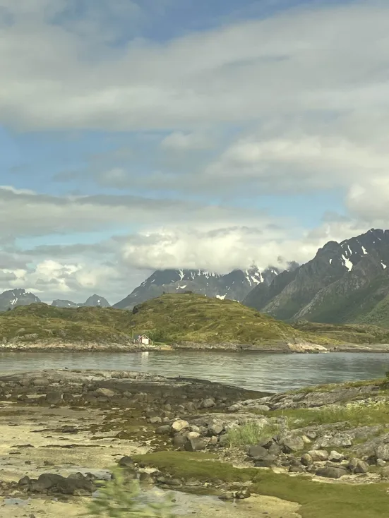
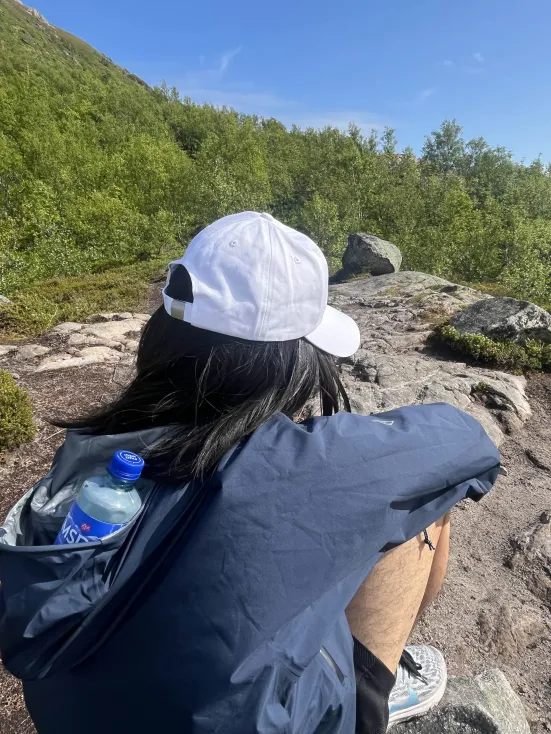
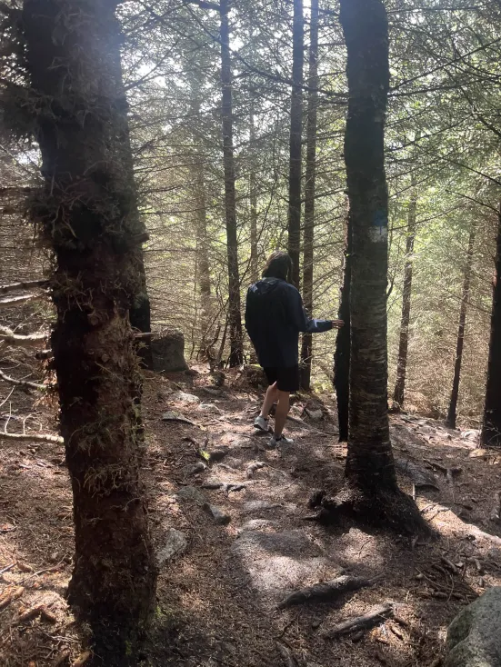

# 0629 (日)

- 天氣 : 晴

今天一個小小的策略錯誤。

因為我和友人 N 從來沒有搭過國內航班，所以我們直接比照國際航班 : 提早三個小時到達機場。

行李因為自助託運 + 可以線上 check-in，很快就辦完了。

結果到了之後我們有整整兩個小時都在不知道幹嘛只好在機場裏面亂逛。

買了一些垃圾跟食物，我跟友人 N 買了雞肉捲，還不錯吃。

此時我們並不知道搭去 lofoten 的飛機可能是我目前搭過最小的一台飛機。

等到登機門資訊出來，看到眼前那台小飛機，我們真的有被嚇到。

怎麼那麼小台。

我們搭的是 wideroe 的飛機，他們家的飛機據說都是小小一台，然後基本上都是飛去一些人很少的小機場，像是 lofoten 的 svolvær 機場。

幸運的是，我們有搶到直飛的票。

只是小飛機坐起確實不太舒服，整個飛機小到只能坐 30 個人左右。很酷的是有提供零食餅乾水供大家在飛機上吃。

只是飛機上很熱，我一直在流汗。

這也是我第一次看到空姐實際操作救生衣如何使用，可能是因為飛機小沒有螢幕他們只好實操吧。

--

飛機逐漸降落時好多人都在拍照，lofoten 島嶼地形稀碎，在降落時就隱約能感覺出來，越接近地面，越震撼，岩石裸露在海面上，浪一拍過去產生白色的浪花，美的像畫。

是那種一下飛機就"啊我來對地方的感覺"。

一下飛機我們很有意識的拿完行李就趕快出去叫計程車，因為根據資料查詢，機場外的計程車可能不是很多，事實也是如此，大概就兩台計程車吧，很幸運我們剛好有搶到一台。

我們 svolvær 的住宿在這裡 : [Rom til leie]()

--

本日預計安排的健行地點 Tjeldbergtind Trail

一路上，風景優美。

我們走在碎石子路上，是很平坦的坡面。沿途會經過一些不知是河水還是湖水、又或者是海水的池子 (友人 N : 喝喝看就知道了)。

誠如伍佰所說 :

那裏的湖面總是澄清。

那裡空氣充滿寧靜。

不過沒有雪白明月照在大地，因為現在永晝，根本沒有晚上 ==。

但悲劇總是接踵而來，大概走了一個小時後我們就覺得不對了。

"我們還沒到嗎?"我問。

"快了。" N 說。

"真得嗎 ? " "應該吧" "我覺得不對ㄟ" "洞在哪 ? " "恩怎麼長得跟照片不一樣 ? "

很好。

從來沒有在我面前帶錯路的友人 N 走錯路了。

我們很傻眼的看著前面的路牌，第一次在國外感受到台灣無所不用其極告訴你路怎麼走的重要性。

原來，在挪威，健行路線會不只一條。但如果這條路線沒有很多人走，根本就不會有地圖立在入口處告訴你怎麼走。

友人 N 和我在那邊研究很久，才發現可能、或許、大概、所有的路都叫 Tjeldbergtind，但只有一條是特別簡單的路。

很不巧，我們選到一條最難的路線，偏偏前天有雨，造成路面濕滑。不放棄的我對 N 進行了思想工作 (為後來哄騙他上 Reine Fjord 奠定了基底)，決定走個半路。

路面超他媽滑。

我本無意在遊記寫髒話，但是真的差點要寄。

最後我們只能爬到半路的山頂，遠眺原應走上的山頭。路上，我們和迎面過來的其他遊客打招呼，望著我們上不了的山。

"沒事啦，來都來了" 我說。

"..."

顯然的 N 不太想理我，難過。

- 最後我們就在這邊坐了半個小時，不過風景還是美麗的

- 那個土 ! 超滑 ! (友人 N : 這裡應該要穿長褲上來)

下山後我們又花了一個半小時走回家，沿途繞去了 svolvær 的另一側。lofoten 真的挺冷的，連我這麼不怕冷的都開始抖。

看著友人 N 穿著 gotex 外套，不愧是明智的選擇。

今天旅遊的最終在我把友人 N 的衣服扒下來穿回去的事件下落幕。

--

晚上 8:00 左右 :

"你想吃曾煮麵嗎" 我拿著自備的鍋子與筷子。

"我沒意見" 友人 N 說。

看著爐灶上的電磁爐，我陷入了迷茫 -- 這怎麼用 ???

 

booking.com 的通訊功能真是個好東西，可以幫助我隨時連絡房東。

我感嘆，終於把麵端上了桌。
